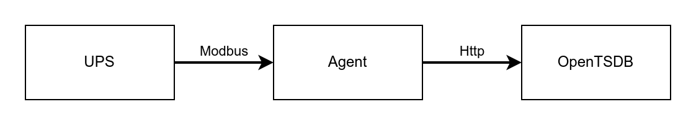

# ups-opentsdb-agent

This application is designed to collect data from the UPS via modbus and send it to the opentsdb.  

Work scheme


In this work was used [mock ups controller](https://github.com/apayvin11/mock-ups-ctrl)

## Getting started

1) Prepare [config](conf/config.toml)  
   example:

   ```txt
   opentsdb_addr = "127.0.0.1:4242"
   ups_addr = "127.0.0.1:1502"
   ups_tag_name = "ups_1" 
   polling_interval = 30 # ups polling interval (sec)
   ```

2) Build
   
   ```bash
   make
   ```

3) Run
   
   ```bash
   ./bin/ups-agent
   ```

## Testing

```bash
make test
```